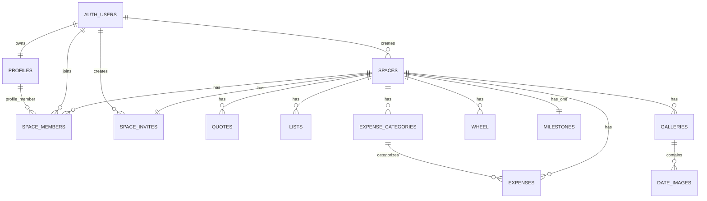

# Backend And Data Model

This document records the backend shape currently used by the app. It combines the SQL schema supplied in the chat, the Supabase calls found in the codebase, and live Supabase introspection output pasted on 2026-05-11.

For refreshed RLS policies, storage policies, grants, indexes, triggers, and bucket settings, run `docs/supabase-introspection.sql` in the Supabase SQL editor.

## Supabase Project

Client:

- `api/clients/supabaseClient.ts`
- Supabase URL: `https://hcrezrypvkmtzxldvsvm.supabase.co`
- Auth storage: AsyncStorage
- Session refresh: enabled
- URL session detection: disabled

The anon key is currently checked into the client code. This is normal for Supabase anon keys when RLS is correct, but it means RLS and Storage policies are the real security boundary.

## Live Supabase Findings

The latest pasted introspection output shows:

- Database: PostgreSQL 15.8.
- Extensions: `pg_stat_statements`, `uuid-ossp`, `pgcrypto`, `plpgsql`, `supabase_vault`.
- Auth users: 9 total, 9 confirmed, 9 with at least one sign-in.
- Public row counts: 4 spaces, 7 space memberships, 4 invite rows, 9 profiles, 11 quotes, 2 milestones, 11 lists, 11 wheels, 23 galleries, 428 gallery image rows.
- Storage counts: `avatars` has 56 objects and about 31.5 MB; `gallery-private` has 1287 objects and about 635 MB.
- RLS is enabled on all current public app tables and on `storage.buckets` / `storage.objects`. RLS is not forced.
- No realtime publication rows were returned by the current introspection output.
- `handle_new_user`, `is_member_of_space`, and `set_updated_at` exist as public functions.
- Update triggers exist for `lists`, `wheel`, `milestones`, and `profiles`.

Important live-policy watch-outs:

- `space_invites_select_for_join` allows any authenticated user to select invite rows. The app queries by code, but direct clients could list all invite codes unless this is moved behind a narrower RPC or policy.
- `quotes` has a public `SELECT true` policy. Quotes are readable by anon/public clients.
- `avatars` is a public bucket and has a public insert policy for `bucket_id = 'avatars'`. That matches public avatar URLs, but it also means uploads are broad unless tightened.
- Storage policies still reference a legacy `gallery` bucket with public all-operation style policies. The current app uses `gallery-private`; remove or lock down the old bucket/policies if they are no longer needed.
- Table grants are broad for `anon` and `authenticated`, which is common in Supabase projects, but it means RLS policies must remain correct.

## Entity Relationship Summary



## Public Tables

### `profiles`

Purpose:

- Stores user-facing profile data for each Supabase Auth user.

Primary key:

- `id uuid`, also a foreign key to `auth.users(id)`.

Used fields:

- `name`
- `avatar_url`
- `avatar_border_color`
- `note`
- `note_updated_at`
- `date_of_birth`
- `created_at`
- `updated_at`

Code paths:

- `providers/auth-provider.tsx`
- `api/endpoints/profiles.ts`
- Home profile cards and settings screens.

Notes:

- Profile update helpers try `update` first, then `insert` if the row does not exist.
- `note` is offline-writeable through the `profile_note` outbox entity.
- Avatar images are stored in the `avatars` bucket and referenced by public URL.
- A live `handle_new_user()` function exists and creates/updates profile rows from auth signup metadata.
- Live RLS allows users to select/update/insert their own profile, plus select profiles for users who share a space.

### `spaces`

Purpose:

- Represents one shared couple space.

Primary key:

- `id uuid`

Used fields:

- `name`
- `created_by`
- `created_at`

Code paths:

- `utils/space-management.ts`
- `app/(login)/space-management.tsx`

Notes:

- `created_by` references `auth.users(id)`.
- The app stores the active `spaces.id` in Secure Store.
- Live RLS allows users to create spaces where `created_by = auth.uid()`.
- Live RLS selects only spaces where `created_by = auth.uid()`. Partner members who did not create the space may not be able to select the `spaces` row directly, which is fine for the current app because it stores and uses `space_id` rather than reading space details.

### `space_members`

Purpose:

- Join table between spaces and users/profiles.

Primary key:

- `(space_id, user_id)`

Foreign keys:

- `space_id` to `spaces(id)` with update/delete cascade.
- `user_id` to `auth.users(id)`.
- `user_id` to `profiles(id)` with update/delete cascade.

Code paths:

- Login space lookup in `api/endpoints/auth.ts`.
- Space creation/join in `utils/space-management.ts`.
- Profile fetching in `api/endpoints/profiles.ts`.

Notes:

- On login, the app selects one membership and stores that `space_id`.
- The app currently assumes one active space per device.
- RLS allows users to insert only their own membership and select memberships for spaces they already belong to.

### `space_invites`

Purpose:

- Stores the invite code for a space.

Primary key:

- `space_id`

Unique fields:

- `code`

Foreign keys:

- `space_id` to `spaces(id)` with update/delete cascade.
- `created_by` to `auth.users(id)`.

Code paths:

- `utils/space-management.ts`
- `api/endpoints/space-invites.ts`
- `components/settings/InviteCode.tsx`

Notes:

- One invite row per space.
- Invite codes are 8 alphanumeric characters generated client-side.
- Live RLS allows all authenticated users to select invite rows for the join flow. Consider replacing this with a `join_space_by_code(code)` RPC if invite-code secrecy becomes important.

### `quotes`

Purpose:

- Stores quotes shown on the home dashboard.

Primary key:

- `id uuid`

Foreign keys:

- `space_id` to `spaces(id)` with update/delete cascade.

Used fields:

- `quote`
- `created_at`
- `space_id`

Code paths:

- `api/endpoints/quotes.ts`
- `components/home/QuoteContainer.tsx`

Notes:

- The app reads quotes ordered by newest first.
- There is no in-app quote creation UI in the current codebase.
- Live RLS allows public read access to quotes.

### `milestones`

Purpose:

- Stores one shared milestone per space.

Primary key:

- `id uuid`

Unique fields:

- `space_id`

Foreign keys:

- `space_id` to `spaces(id)` with update/delete cascade.

Used fields:

- `title`
- `date`
- `updated_at`
- `deleted_at`

Code paths:

- `stores/MilestoneStore.ts`
- Home shared milestone card.
- `app/(settings)/shared-milestone.tsx`

Notes:

- The app upserts by `space_id`.
- The TypeScript `Milestone` interface currently types `id` as `number`, while the database schema uses `uuid`. The store works around offline rows with `id: 0`; future type cleanup should align this with the database.
- Shared milestone is offline-writeable through an outbox `upsert`.
- Live RLS allows space members to select, insert, and update milestones. No delete policy was returned.

### `lists`

Purpose:

- Stores notes/lists for a space.

Primary key:

- `id uuid`

Foreign keys:

- `space_id` to `spaces(id)` with update/delete cascade.

Used fields:

- `type` as title/name.
- `content` as body.
- `last_updated_at` for user-level list ordering.
- `updated_at` and `deleted_at` for offline sync support.

Code paths:

- `stores/ListStore.ts`
- `app/(tabs)/(lists)/lists.tsx`

Notes:

- Fully offline-writeable.
- Current outbox sync performs physical Supabase deletes, not server-side soft deletes.
- Live RLS allows space members to select, insert, update, and delete list rows.

### `expense_categories`

Purpose:

- Stores space-scoped expense categories for the expense tracker.

Primary key:

- `id uuid`

Foreign keys:

- `space_id` to `spaces(id)` with delete cascade.
- `created_by` to `auth.users(id)` with delete set null.

Used fields:

- `name`
- `color`
- `sort_order`
- `is_default`
- `created_at`
- `updated_at`
- `deleted_at`

Code paths:

- `stores/ExpenseStore.ts`
- `components/expenses/CategoryManagerModal.tsx`
- `app/(tabs)/(expenses)/expenses.tsx`

Notes:

- Default categories are Food, Health, Medical, Bills, and Transport.
- Categories can be added, renamed, recolored, and soft-deleted.
- Deleting a category does not delete historical expenses; expense rows keep `category_name` and `category_color` snapshots.
- RLS should allow space members to select, insert, and update category rows for their space.

### `expenses`

Purpose:

- Stores expense-only tracking rows for a shared space.

Primary key:

- `id uuid`

Foreign keys:

- `space_id` to `spaces(id)` with delete cascade.
- `created_by` to `auth.users(id)` with delete cascade.
- `paid_by` to `auth.users(id)` with delete cascade.
- `category_id` to `expense_categories(id)` with delete set null.

Used fields:

- `title`
- `description`
- `amount`
- `currency`
- `base_amount`
- `base_currency`
- `exchange_rate`
- `exchange_rate_date`
- `conversion_status`
- `category_id`
- `category_name`
- `category_color`
- `paid_at`
- `created_by`
- `paid_by`
- `created_at`
- `updated_at`
- `deleted_at`

Code paths:

- `stores/ExpenseStore.ts`
- `components/expenses/ExpenseModal.tsx`
- `components/expenses/ExpenseRow.tsx`
- `components/expenses/ExpenseBreakdownView.tsx`
- `utils/expenses.ts`

Notes:

- The creator records who logged the row. `paid_by` records whether the current user or partner paid.
- Default base currency is SGD.
- Foreign-currency expenses store original amount/currency plus a converted SGD snapshot.
- Rows can be saved with `conversion_status = 'pending'` while offline without a cached exchange rate.
- Expense deletes are soft deletes via `deleted_at`.
- Breakdown supports both-partners and current-user scopes. Current-user scope filters by `paid_by`.
- RLS should allow space members to select, insert, update, and delete expense rows for their space.

### `expense_budgets`

Purpose:

- Stores monthly SGD category budgets for the expense tracker.

Primary key:

- `id uuid`

Foreign keys:

- `space_id` to `spaces(id)` with delete cascade.
- `created_by` to `auth.users(id)` with delete cascade.
- `owner_user_id` to `auth.users(id)` with delete cascade.
- `category_id` to `expense_categories(id)` with delete cascade.

Used fields:

- `scope` as `space` for shared budgets or `user` for personal budgets.
- `owner_user_id`, null for shared budgets and set to the current user for personal budgets.
- `category_id`
- `category_name`
- `category_color`
- `month`, stored as the first day of the month.
- `amount`
- `currency`, fixed to SGD.
- `created_at`
- `updated_at`
- `deleted_at`

Code paths:

- `stores/ExpenseStore.ts`
- `components/expenses/ExpenseBudgetView.tsx`
- `components/expenses/BudgetModal.tsx`
- `utils/expenses.ts`

Notes:

- Budget view is monthly only and uses the same Both/Me scope toggle as expenses.
- Both/shared budgets are visible to space members. Me/personal budgets are visible only to the owning user.
- If a selected month has no budgets for the active scope, the app copies the previous month's budgets for that same scope.
- Budget deletes are soft deletes via `deleted_at`.

### `wheel`

Purpose:

- Stores decision wheels and their choices.

Primary key:

- `id uuid`

Foreign keys:

- `space_id` to `spaces(id)` with update/delete cascade.

Used fields:

- `title`
- `choices text[]`
- `created_at`
- `updated_at`
- `deleted_at`

Code paths:

- `stores/WheelStore.ts`
- `app/(tabs)/(wheel)/wheel.tsx`
- `components/wheel/SpinningWheel.tsx`
- `components/wheel/EditChoicesModal.tsx`

Notes:

- Fully offline-writeable.
- Current outbox sync performs physical Supabase deletes, not server-side soft deletes.
- Live RLS allows space members to select, insert, update, and delete wheel rows.

### `galleries`

Purpose:

- Stores gallery/date metadata and cover image references.

Primary key:

- `id uuid`

Foreign keys:

- `space_id` to `spaces(id)` with update/delete cascade.

Used fields:

- `title`
- `date`
- `date_date`
- `color`
- `location`
- `cover_image_path`
- `cover_image_thumb_path`
- `cover_image_blur_hash`
- `created_at`

Code paths:

- `stores/GalleryStore.ts`
- `hooks/useGalleryList.ts`
- `hooks/useGalleryContent.ts`
- Gallery screens and components.

Notes:

- Gallery list is paginated with page size 10.
- Gallery list sorting uses the `date` text column in current queries.
- `date_date` is derived on creation but not yet used by the app's queries.
- Gallery writes are online-only.
- Live indexes exist for both `(space_id, date, id)` and `(space_id, date_date, id)` in ascending and descending forms.
- Live RLS allows space members to select, insert, update, and delete gallery rows.

### `date_images`

Purpose:

- Stores one row per gallery image and the storage paths/metadata for all generated variants.

Primary key:

- `id uuid`

Foreign keys:

- `gallery_id` to `galleries(id)` with update/delete cascade.

Used fields:

- `storage_path_thumb`
- `storage_path_grid`
- `storage_path_orig`
- `blur_hash`
- `created_at`
- dimensions and byte counts for each variant
- `bytes_total`

Code paths:

- `stores/GalleryStore.ts`
- Gallery image grid and viewer.
- Edge Function `sign-gallery-urls`.

Notes:

- Images are paginated with page size 20 by `created_at` and `id`.
- The app inserts a row first, uploads variants to Storage, then updates the row with paths and metadata.
- Live indexes exist for `gallery_id` and `(gallery_id, created_at desc, id desc)`.
- Live RLS allows gallery space members to select, insert, update, and delete image rows.
- Live foreign keys cascade image rows when a gallery is deleted, but the app still deletes image rows explicitly so it can clean up Storage objects.

## Storage Buckets

### `avatars`

Purpose:

- Stores user avatar JPEGs.

Code paths:

- `api/endpoints/profiles.ts`
- `utils/home.ts`
- `app/(onboarding)/index.tsx`

Behavior:

- Files are named `{userId}-{timestamp}-avatar.jpg`.
- The app calls `getPublicUrl`.

Live verification:

- The bucket is public.
- Latest introspection showed 56 objects and about 31.5 MB.
- Storage policies allow public inserts into `avatars`. Public read is expected because the bucket itself is public.

### `gallery-private`

Purpose:

- Stores private gallery images.

Code paths:

- `stores/GalleryStore.ts`
- Edge Functions under `supabase/functions/`

Path convention:

```text
spaces/{spaceId}/galleries/{galleryId}/images/{imageId}/thumb.jpg
spaces/{spaceId}/galleries/{galleryId}/images/{imageId}/grid.jpg
spaces/{spaceId}/galleries/{galleryId}/images/{imageId}/orig.jpg
```

Behavior:

- The app does not use public URLs for gallery images.
- It requests signed URLs with a one-hour TTL.
- Signed URLs are cached locally for offline reading, but may expire.

Live verification:

- The bucket is private.
- Latest introspection showed 1287 objects and about 635 MB.
- Storage policies allow authenticated members of the path's space to select, insert, update, and delete objects. The policy derives `space_id` from the second path segment in `spaces/{spaceId}/...`.

### Legacy `gallery`

The live policy output still includes public all-operation policies for a bucket named `gallery`. The current codebase does not use this bucket; current gallery code uses `gallery-private`.

If the old bucket is no longer used, remove the bucket and its storage policies or lock them down to avoid accidental public access.

## RLS Policy Summary

Current live RLS shape:

| Resource | Policy shape |
| --- | --- |
| `profiles` | Authenticated users can select/update/insert their own row. They can also select profiles for users who share a space. |
| `spaces` | Authenticated users can insert spaces where `created_by = auth.uid()`. Select is limited to creator-owned spaces. |
| `space_members` | Authenticated users can insert their own membership and select memberships for spaces they belong to. |
| `space_invites` | Space creators can insert invite rows for their own spaces. Any authenticated user can select invite rows. |
| `quotes` | Public select access. |
| `milestones` | Space members can select, insert, and update. |
| `lists` | Space members can select, insert, update, and delete. |
| `expense_categories` | Space members can select, insert, and update; app deletes use soft-delete updates. |
| `expenses` | Space members can select, insert, update, and delete; app deletes use soft-delete updates. |
| `expense_budgets` | Space members can read/write shared budgets; users can read/write only their own personal budgets. |
| `wheel` | Space members can select, insert, update, and delete. |
| `galleries` | Space members can select, insert, update, and delete. |
| `date_images` | Members of the parent gallery's space can select, insert, update, and delete. |
| `storage.objects` for `gallery-private` | Authenticated members of the space encoded in the object path can select, insert, update, and delete. |

### `expense_report_deliveries`

Purpose:

- Provides idempotency and retry state for scheduled Telegram expense reports.

Key fields:

- `space_id`, `report_type`, `period_start`, and exclusive `period_end` uniquely identify a report.
- `status` is `sending`, `sent`, or `failed`.
- `attempt_count`, `last_attempt_at`, and `error` record retry state.
- `telegram_message_id` and `sent_at` record successful delivery.

Security and behavior:

- RLS is enabled with no client policies or client grants.
- The scheduled `expense-report` Edge Function accesses the table with the RLS-bypassing backend secret key.
- Failed rows may be conditionally reclaimed; sent and sending rows suppress duplicate delivery.
- An ambiguous Telegram transport failure remains `sending` because Telegram may have accepted the message before the response was lost.

Migration:

- `supabase/migrations/20260901000000_expense_report_deliveries.sql`

## Edge Functions

### `sign-gallery-urls`

File:

- `supabase/functions/sign-gallery-urls/index.ts`

Input:

```json
{
  "galleryId": "uuid",
  "imageIds": ["uuid"]
}
```

Behavior:

- Requires POST and Authorization header.
- Creates a user-scoped Supabase client with the anon key and caller JWT.
- Reads matching `date_images` rows for the gallery through RLS.
- Signs thumb, grid, and original storage paths in `gallery-private`.
- Returns a map keyed by image id with `url_thumb`, `url_grid`, and `url_orig`.

### `sign-gallery-cover-urls`

File:

- `supabase/functions/sign-gallery-cover-urls/index.ts`

Input:

```json
{
  "paths": ["spaces/.../thumb.jpg"]
}
```

Behavior:

- Requires POST and Authorization header.
- Accepts up to 200 unique paths.
- Validates every path with the expected cover-thumb path regex.
- Signs each path in `gallery-private`.
- Returns a map of storage path to signed URL.

### `delete-gallery`

File:

- `supabase/functions/delete-gallery/index.ts`

Input:

```json
{
  "galleryId": "uuid"
}
```

Behavior:

- Requires POST and Authorization header.
- Creates a user-scoped Supabase client with the anon key and caller JWT.
- Checks the gallery exists through RLS.
- Reads all image storage paths.
- Removes storage objects in chunks of 100.
- Deletes `date_images` rows.
- Deletes the `galleries` row.
- Returns structured success/failure metadata.

### `expense-report`

Files:

- `supabase/functions/expense-report/index.ts`
- `supabase/functions/expense-report/report.ts`
- `supabase/functions/expense-report/telegram.ts`

Input:

```json
{"mode":"weekly"}
```

or:

```json
{"mode":"monthly"}
```

Behavior:

- Requires `POST` and a matching `x-expense-report-secret` header; JWT verification is disabled because this is a Cron endpoint rather than a user endpoint.
- Uses the `default` key from `SUPABASE_SECRET_KEYS`, with `SUPABASE_SERVICE_ROLE_KEY` as a legacy compatibility fallback.
- Validates configured Dudu and Bubu profiles and membership in the configured space.
- Calculates the just-completed weekly or monthly period with explicit `Asia/Singapore` boundaries.
- Excludes soft-deleted and unreportable foreign-currency expenses, and uses `paid_by` for Dudu/Bubu ownership.
- Uses active category data first and stored expense snapshots as fallback.
- Claims `expense_report_deliveries`, formats both modes through one formatter, and sends plain text to the configured Telegram `message_thread_id`.
- Saves Telegram's returned `message_id` after success.

Scheduling and operations are documented in `docs/expense-tracker.md`. Cron jobs are configured after environment-specific project URL, publishable key, and Cron secret values are stored in Supabase Vault.

## Local SQLite Cache

File:

- `utils/offline/local-db.ts`

Database:

- `bubududu-offline.db`

Version:

- `PRAGMA user_version = 3`

Tables:

- `lists_cache`
- `wheels_cache`
- `milestones_cache`
- `profiles_cache`
- `quotes_cache`
- `galleries_cache`
- `gallery_images_cache`
- `expense_categories_cache`
- `expense_budgets_cache`
- `expenses_cache`
- `expense_exchange_rates_cache`
- `sync_outbox`

Outbox entities:

- `lists`
- `wheel`
- `milestones`
- `profile_note`
- `expense_categories`
- `expense_budgets`
- `expenses`

Outbox operations:

- `insert`
- `update`
- `delete`
- `upsert`

Cache lifecycle:

- Initialized by `OfflineProvider`.
- Cleared on normal sign out and emergency login reset.

## Sync Strategy

File:

- `utils/offline/sync.ts`

Behavior:

- `flushOutbox` is guarded by a shared `syncPromise` to avoid concurrent flushes.
- If offline, it returns immediately.
- Outbox rows are flushed oldest first.
- Successful items are removed.
- Failed items remain queued with incremented `attempts` and `last_error`.
- `SyncStore` tracks `isSyncing`, `pendingCount`, `lastSyncedAt`, and `lastError`.

Important caveats:

- Lists and wheels have `deleted_at` columns, but current remote sync uses `.delete()`.
- Expenses and expense categories use `deleted_at` soft-delete updates during sync.
- Conflict behavior is effectively last queued write wins.
- There is no field-level merge logic.

## Refreshing Live Backend Details

The source code and supplied schema do not show all production backend settings. The 2026-05-11 output has been incorporated above, but use `docs/supabase-introspection.sql` again whenever backend policies or tables change. It verifies:

- Which public tables have RLS enabled and forced.
- Exact table policies and storage policies.
- Bucket privacy for `avatars` and `gallery-private`.
- All indexes and triggers on public tables.
- Definitions for public database functions such as `set_updated_at`.
- Grants to `anon`, `authenticated`, and `service_role`.
- Realtime publication membership.
- Data counts and storage object counts without exposing row contents.
- Auth user counts and auth triggers on `auth.users`.
